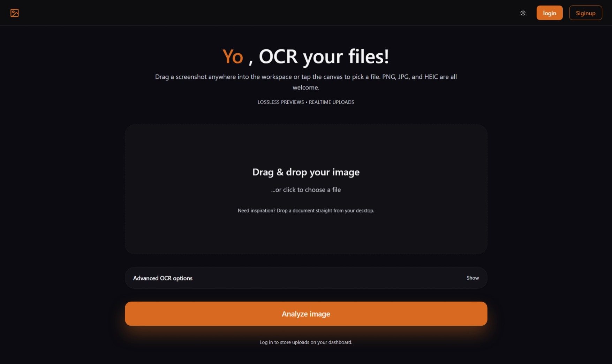

# Text Extractor - OCR in your Browser

*Yo, OCR your files!*



## About The Project

A simple, web-based tool to extract text from your images directly in your browser. Built with Svelte and [Tesseract.js](https://tesseract.projectnaptha.com/), it offers a private and fast way to perform Optical Character Recognition (OCR) without sending your data to a server.

### Built With

*   [Svelte](https://svelte.dev/)
*   [Vite](https://vitejs.dev/)

## Backend & API

*   **API Documentation**: [api_endpoints.md](API_endpoints.md)
*   **Backend Repository**: [https://github.com/karar-hayder/Backend](https://github.com/karar-hayder/Backend)

## Getting Started

To get a local copy up and running, follow these simple steps.

### Prerequisites

Make sure you have [Node.js](https://nodejs.org/) and npm installed on your machine.

*   npm
    ```sh
    npm install npm@latest -g
    ```

### Installation

1.  Clone the repo (replace `your_username/your_repository` with your actual repo path)
    ```sh
    git clone https://github.com/Majarra0/text-extraction.git
    ```
2.  Install NPM packages
    ```sh
    npm install
    ```
3.  Start the development server
    ```sh
    npm run dev
    ```

## Usage

1.  Open the application in your browser (usually at `http://localhost:5173`).
2.  Drag and drop an image file (e.g., PNG, JPG) onto the drop zone, or click to select a file.
3.  Wait for the OCR process to complete.
4.  The extracted text will appear in the text area. You can then copy it to your clipboard.
